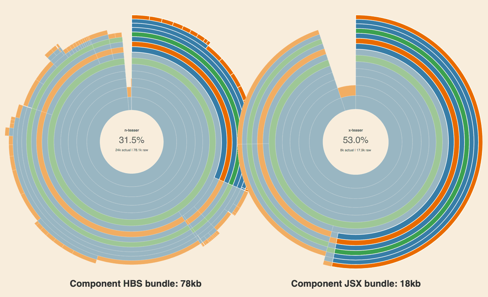

# Design Decisions: HTML Templating

UI components provided by Page Kit are authored using [JSX]. This is a major change from the existing FT.com toolset.

Since the Next team started the rebuild of FT.com in 2014 we've used [Handlebars] to render HTML templates in our applications. With [Express] integration it's been easy for us to render our HTML pages on the server and send them to our users:

```js
app.get('/', (request, response) => {
  const data = {}
  response.render('view.html', data)
})
```

Handlebars has done a good job but it now requires the team to maintain a lot of extra code in order to use it effectively. Over time we have created a suite of helper functions, integrations for templates provided by packages installed with Bower or npm, additional wrappers, and template inheritance. This all works OK on the server but it is complicated and adds _a lot_ of bloat when adapted for use in the browser:



Last year the [x-dash] project was started to explore how the app and website codebases could be brought into closer alignment. For this project JSX was chosen rather than Handlebars to make integration with the app (which already used [Preact]) smoother and gain access to a modern tooling ecosystem. The teams experience with JSX was positive and proved it was a viable option for rendering templates.

We think JSX has several key advantages over Handlebars that are worth the effort of migration:

- It works in the same way on the server and in the browser.
- Components are authored as JavaScript files and integrate seamlessly with the JS ecosystem.
- Almost every JavaScript parser, linter, compiler, and editor support JSX syntax out of the box.
- Enables access to a modern ecosystem of fantastic development tools like [Storybook].
- Components can be rendered with [many] [different] [libraries], not just [React].

This opinion was also backed up by [the survey] we sent to the customer products engineering team. We asked "Which tool would you choose to provide server-side rendering for your app?" and only 18% of the respondents told us that they would choose Handlebars but 67% said they would choose the same tool as they would use on the client-side. When asked "Which tools would you choose to build the client-side parts for your app?" 67% of respondants indicated that they would choose React or a similar library.

[Handlebars]: https://handlebarsjs.com/
[Express]: https://expressjs.com/
[view engine]: https://expressjs.com/en/guide/using-template-engines.html
[x-dash]: https://financial-times.github.io/x-dash/
[Preact]: https://preactjs.com/
[JSX]: https://jasonformat.com/wtf-is-jsx/
[Storybook]:https://storybook.js.org/
[React]: https://reactjs.org/
[many]: https://github.com/jorgebucaran/hyperapp
[different]: https://github.com/i-like-robots/hyperons
[libraries]: https://infernojs.org/
[the survey]: https://docs.google.com/document/d/1CxmHvsAfNmar-1kuQEQSawL6jcjc1OrY4mXtvhsq9K4/edit?usp=sharing


## Conclusion

The Page Kit team chose to use JSX instead of Handlebars for rendering HTML because it works well on both the server and client-side, is supported by many tools out of the box, enables access to a wide ecosystem of tools, can be used with a variety of different libraries, and is what the _majority of the customer products engineering team want to use_.
