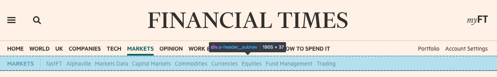

# anvil-server-ft-navigation

This module exposes a Navigation class with some methods for accessing navigation data for ft.com.

It is intended to be consumed by a Navigation middleware such as [`anvil-middleware-ft-navigation`](https://github.com/Financial-Times/anvil/tree/master/packages/anvil-middleware-ft-navigation) which can handle the responses.

Instances of Navigation will periodically fetch navigation data from the [Origami navigation service](https://registry.origami.ft.com/components/origami-navigation-service@71.0.0) via [ft-poller](https://github.com/Financial-Times/ft-poller). This data is managed by editorial staff and is used to render the navigation components on FT.com including the header, drop-down menus, drawer and footer.

```ts
import Navigation from '@financial-times/anvil-server-ft-navigation'

const navigation = new Navigation()

navigation.getNavigationData(): Promise<TNavMenus>
navigation.getPathMenu(menuId: string, path: string): Promise<TNavMenu>
navigation.getSubNavigation(path: string): Promise<object>
```

## API

### `constructor(options?: TNavOptions)`

Options will be merged with the following defaults:

```js
{
  menuUrl: 'http://next-navigation.ft.com/v2/menus',
  subNavigationUrl: 'http://next-navigation.ft.com/v2/hierarchy',
  interval: 15 * 60 * 1000 // poll every 15 minutes
}
```

### `getMenuData(path: string): Promise<TNavMenus>`

Returns the full, decorated navigation data, refreshed every 15 minutes.

Data is keyed by menuId, values match the output of `getPathMenu(menuId, path)`

- "account"
- "drawer-uk"
- "drawer-international"
- "user"
- "anon"
- "footer"
- "navbar-simple"
- "navbar-right"
- "navbar-right-anon"
- "navbar-uk"
- "navbar-international"

### `getPathMenu(menuId: string, path: string): Promise<TNavMenu>`

Returns the navigation data for the supplied `menuId` (see above), decorated per `path`:
- A `selected` property is added to all items; value is `true` or `false` depending on whether the `url` property matches `path`
- Redirect urls are set to value of the `path` parameter (e.g. allowing `/login?location=<path>` to redirect back to the referring page)

Calling
```js
navigation.getPathMenu('drawer-uk', '/world/uk')
```

Returns:
```js
{
  label: 'Drawer',
  items: [
    {
      label: 'Foo',
      url: '/world/uk',
      submenu: null,
      selected: true  // property added; value is true because it matches `path`
    },
    {
      label: 'Bar',
      url: '/fake-item?location=/world/uk', // location set to
      submenu: null,
      selected: false // property added;
    }
  ]
}
```

### `getSubNavigation(path: string)`

Returns the crumbtrail data for `path`. The crumbtrail is the data which populates the header-subnav element:




## Modifying Crumbtrail data

The data from `getSubNavigation`  methods is frozen to prevent accidental mutation of the `Poller` instance's data as it is passed around. If you need to modify any part of the data, you should first clone the parts you need and then work with your cloned object.

```js
const menuItem = getSubNavigation('/world/uk')
const clone = menuItem => JSON.parse(JSON.stringify(menuItem));
```
