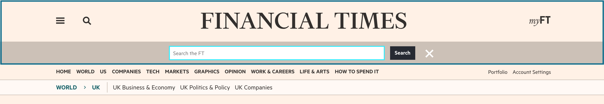
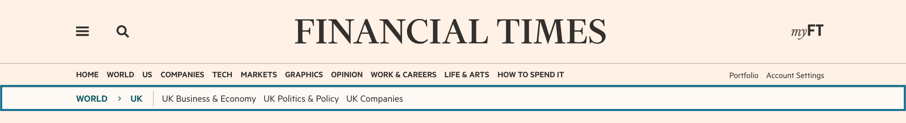

# @financial-times/anvil-ui-ft-header

This package provides templates which render variants of the page header and navigation drawer for ft.com.


## Getting started

### Installation

This module is compatible with Node 10+ and is distributed on npm.

```bash
npm install --save @financial-times/anvil-ui-ft-header
```

Create an [Express] server using the [anvil-middleware-ft-navigation] middleware.

### Server-side

To render header components include them in your template code and pass in a data object. The data can be fetched using the [anvil-server-ft-navigation] package or it's middleware.

```jsx
import { Header, Drawer } from 'anvil-ui-ft-header'
const header = () => {
  <Header {...headerProps} />
  <Drawer {...headerProps}/>
}
```

### Client-side

Once you are rendering the header components in your page you will need to initialise the client-side code to add interactive behaviour including search typeahead and toggling the drawer menu and sticky header.

```js
import * as header from '@financial-times/anvil-ui-ft-header'

header.init()
```


## Props

All variants with the exception of `LogoOnly` require a props object to be passed to the header component. The component can be configured by setting properties on this object.

|       PROP        |  TYPE   | OPTIONAL | DEFAULT  |                                            DESCRIPTION                                            |
| ----------------- | ------- | -------- | -------- | ------------------------------------------------------------------------------------------------- |
| variant           | string  | true     | 'simple' | Serve a variant of the default header element                                                     |
| hideOutboundLinks | boolean | true     | false    | An iOS setting which removes the link tag around the ft logo element for Apple compliance reasons |
| userIsAnonymous   | boolean | true     | true     | Marks a user as anonymous - can be set by middleware included with n-express                      |
| userIsLoggedIn    | boolean | true     | false    | Marks a user as logged in - can be set by middleware included with n-express                      |
| showUserNav       | boolean | true     | true     | Show user navigation options - `Portfolio` and `Account Settings` or `Sign in` and `Subscribe`    |
| showSubNavigation | boolean | true     | true     | Show the sub-navigation element which may include the crumbtrail                                  |
| disableSticky     | boolean | true     | false    | Prevents the StickyHeader component from rendering                                                |
| data              | object  | false    |          | Navigation data for rendering the header links - takes the shape of [Data Props](#data-props)     |


## Navigation data

The props object passed to the header component must have a `data` property. The data is expected to come from the [navigation API] and should have the following properties.

|       PROP        |                                                         DESCRIPTION                                                         |
| ----------------- | --------------------------------------------------------------------------------------------------------------------------- |
| currentPath       | The url for which data has been requested                                                                                   |
| editions          | Detailing the `current` and `other` available editions                                                                      |
| drawer            | Populates the drawer menu elements                                                                                          |
| navbar            | Populates the primary navigation links and any associated meganav components                                                |
| navbar-right      | Logged in user navigation options - rendered if `showUserNav` is true                                                       |
| navbar-right-anon | Anonymous user navigation options - rendered if `showUserNav` is true                                                       |
| navbar-simple     | Minimal navigation links for displaying navigation on smaller viewports                                                     |
| breadcrumb        | Populates the ancestors section of the subNavigation                                                                        |
| subsections       | Populates the children section of the subNavigation                                                                         |
| user              | Populates the last section of the drawer with `Help Centre`, `Account Settings`, `Contact Preferences` and `Sign out` links |

## Variants

A variant property can be configured on the data object which is passed to the header component. The available variants are:

|  VARIANT  |                                                                           DESCRIPTION                                                                           |
| --------- | --------------------------------------------------------------------------------------------------------------------------------------------------------------- |
| simple    | The default variant of the header top element which is used on most ft.com pages including article pages - it is narrower than the homepage masthead            |
| home      | Use the taller, 'masthead' variant of the header top element - this overrides the default `simple` style and is used on the ft.com homepage and on stream pages |
| sticky    | Render the sticky header after a predetermined scroll-depth                                                                                                     |
| logo-only | Render without the drawer, search or myFT elements - this pattern is used in several conversion apps                                                            |


## Header Elements

### Header top

The primary header element on ft.com.

The default header contains `drawer` `search` and `myFT` links. The search element is hidden if JavaScript is present and accessible via the search icon.

Note: The myFT unread articles indicator code lives outside this package and depends on the [`o-header__top-link--myft`] class being present in the header.




### Header navigation

The header navigation will be rendered as part of the default header. It contains the primary content links for navigating ft.com and optionally contains user navigation links. Where meganav data exists a meganav component will be attached to the relevant navbar items.

The `editions` and `navbar` properties are added to the navigation data by the [anvil-server-ft-navigation] package. The data is regionally-specific to either the UK or International edition.


### Header subNavigation

Unless `showSubNavigation` is set to `false` the subNavigation element will be rendered as part of the default header if subNavigation data exists for the requested page. Some stream pages on ft.com contain a subNavigation element and myFT pages contain a submenu which uses the subNavigation element as its base.

The `breadcrumb` and `subsections` properties are required to render the subNavigation. They are added to the navigation data by the [anvil-server-ft-navigation] package and the data is page-specific.




### Drawer

The drawer menu is a separate component and is not included in the default header. It will need to be rendered separately.

To support core experience the drawer component should be included in the html template *below the footer component*.

```jsx
import { Footer } from 'anvil-ui-ft-footer'
import { Drawer } from 'anvil-ui-ft-header'
let navigationProps

navigationProps.data = response.locals.navigation

<Footer {...navigationProps.footer} />
<Drawer {...navigationProps} />
```


## Storybook

[Storybook] has been configured for all UI packages in Anvil. From the root of the anvil directory, run:

```bash
npm run storybook
```

The storybook will launch on port: 9001. The header stories will be available under 'FT > Header'.

[Express]: https://expressjs.com/
[Storybook]: https://storybook.js.org/
[navigation API]: https://github.com/Financial-Times/next-navigation-api
[Origami Navigation Service]: https://www.ft.com/__origami/service/navigation/v2/
[anvil-ui-ft-footer]: https://github.com/Financial-Times/anvil/tree/master/packages/anvil-ui-ft-footer
[anvil-server-ft-navigation]: https://github.com/Financial-Times/anvil/tree/master/packages/anvil-server-ft-navigation
[anvil-middleware-ft-navigation]: https://github.com/Financial-Times/anvil/tree/master/packages/anvil-middleware-ft-navigation
[`o-header__top-link--myft`]: https://github.com/Financial-Times/n-myft-ui/blob/master/components/unread-articles-indicator/index.js#L55
