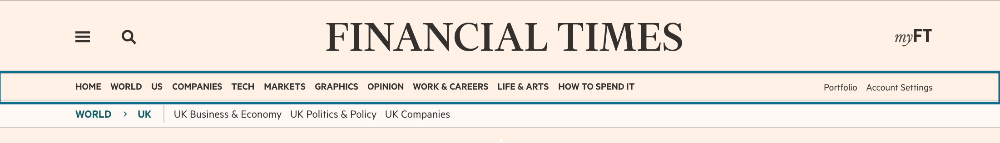

# @financial-times/anvil-ui-ft-header

This package provides components which return variants of the header components for ft.com; the standard ft.com `HeaderDefault`, a `HeaderSticky`, and a `LogoOnly` variant as well as the `Drawer` component which is rendered separately.


### Getting started

This module is compatible with Node 10+ and is distributed on npm.

```bash
npm install --save @financial-times/anvil-ui-ft-header
```

Create an [Express] server using the [anvil-middleware-ft-edition] and [anvil-middleware-ft-navigation] middlewares.

```js
const express = require('express')

const editionMiddleware = require('@financial-times/anvil-middleware-ft-edition')
const navigationMiddleware = require('@financial-times/anvil-middleware-ft-navigation')

const app = express()

app.use(editionMiddleware.init())
app.use(navigationMiddleware.init())

module.exports = app
```

Include a header component in your html template and pass in a data object:

```jsx
import { HeaderDefault } from 'anvil-ui-ft-header'
let headerProps

headerProps.data = response.locals.navigation
headerProps.data.editions = response.locals.editions

<HeaderDefault {...headerProps} />
```


## Props

The header can be configured by setting props on the data object.

|       PROP        |  TYPE   | OPTIONAL | DEFAULT  |                                                    DESCRIPTION                                                    |
| ----------------- | ------- | -------- | -------- | ----------------------------------------------------------------------------------------------------------------- |
| variant           | string  | true     | 'simple' | Serve a variant of the default header element                                                                     |
| hideOutboundLinks | boolean | true     | false    | An iOS setting which removes link functionality from the header and hides the footer for Apple compliance reasons |
| userIsAnonymous   | boolean | true     | true     | Marks a user as anonymous - set in n-express                                                                      |
| userIsLoggedIn    | boolean | true     | false    | Marks a user as logged in - set in n-express                                                                      |
| showUserNav       | boolean | true     | true     | Show user navigation options - `Portfolio` and `Account Settings` or `Sign in` and `Subscribe`                    |
| showSubNav        | boolean | true     | true     | Show the crumbtrail element or the myFT subnav element                                                            |
| data              | object  | false    |          | Navigation data for rendering the header components - takes the shape of [Data Props](#data-props)                |


## Data Props

Unless the `logo-only` variant is specified the header expects a data object from the [navigation API] to be passed in with the following properties.

|       PROP        |                                                         DESCRIPTION                                                         |
| ----------------- | --------------------------------------------------------------------------------------------------------------------------- |
| editions          | Detailing the `current` and `other` available editions                                                                      |
| drawer            | Populates the drawer menu elements                                                                                          |
| navbar            | Populates the primary navigation links and any associated meganav components                                                |
| navbar-right      | Logged in user navigation options - rendered if `showUserNav` is true                                                       |
| navbar-right-anon | Anonymous user navigation options - rendered if `showUserNav` is true                                                       |
| navbar-simple     | Minimal navigation links for displaying navigation on smaller viewports                                                     |
| breadcrumb        | Populates the ancestors section of the crumbtrail                                                                           |
| subsections       | Populates the children section of the crumbtrail                                                                            |
| user              | Populates the last section of the drawer with `Help Centre`, `Account Settings`, `Contact Preferences` and `Sign out` links |

## Variants

The default variant is 'simple' which relates to the compact masthead. The alternative variants are:

|  VARIANT  |                                                            DESCRIPTION                                                            |
| --------- | --------------------------------------------------------------------------------------------------------------------------------- |
| home      | Use the taller, 'masthead' variant - this overrides the default `simple` style and is used on the ft.com homepage and stream pages |
| sticky    | Render the sticky header after a predetermined scroll-depth                                                                       |
| logo-only | Render without the drawer, search or myFT elements - this pattern is used in several conversion apps                               |


## Header Elements

### Header top

The primary header element on ft.com.

The default header contains `drawer` `search` and `myFT` links. The search element is hidden if JavaScript is present and accessible via the search icon.

Note: The myFT unread articles indicator code lives outside this package and depends on the [`o-header__top-link--myft`] class being present in the header.


### Header navigation

The header navigation will be rendered as part of the default header. It contains the primary content links for navigating ft.com and optionally contains user navigation links. Where meganav data exists a meganav component will be attached to the relevant navbar items.

The `editions` and `navbar` properties are added to the navigation data by the [anvil-server-ft-navigation] package. The data is regionally-specific to either the UK or International edition.




### Header crumbtrail

Unless `showSubNav` is set to `false` the crumbtrail element will be rendered as part of the default header if crumbtrail data exists for the requested page. Some stream pages on ft.com contain a crumbtrail element and myFT pages contain a subnav which uses the crumbtrail element as its base.

The `breadcrumb` and `subsections` properties are required to render the crumbtrail. They are added to the navigation data by the [anvil-server-ft-navigation] package and the data is page-specific.


### Drawer

The drawer menu is a separate component and is not included in the default header. It will need to be rendered separately.

To support core experience the drawer component should be included in the html template *below the footer component*.

```jsx
import { Footer } from 'anvil-ui-ft-footer'
import { Drawer } from 'anvil-ui-ft-header'
let navigationProps

navigationProps.data = response.locals.navigation

<Footer {...navigationProps.footer} />
<Drawer {...navigationProps} />
```


## Storybook

[Storybook] has been configured for all UI packages in Anvil. From the root of the anvil directory, run:

```bash
npm run storybook
```

The storybook will launch on port: 9001. The header stories will be available under 'FT > Header'.

[Express]: https://expressjs.com/
[Storybook]: https://storybook.js.org/
[navigation API]: https://github.com/Financial-Times/next-navigation-api
[Origami Navigation Service]: https://www.ft.com/__origami/service/navigation/v2/
[anvil-ui-ft-footer]: https://github.com/Financial-Times/anvil/tree/master/packages/anvil-ui-ft-footer
[anvil-server-ft-navigation]: https://github.com/Financial-Times/anvil/tree/master/packages/anvil-server-ft-navigation
[anvil-middleware-ft-edition]: https://github.com/Financial-Times/anvil/tree/master/packages/anvil-middleware-ft-edition
[anvil-middleware-ft-navigation]: https://github.com/Financial-Times/anvil/tree/master/packages/anvil-middleware-ft-navigation
[`o-header__top-link--myft`]: https://github.com/Financial-Times/n-myft-ui/blob/master/components/unread-articles-indicator/index.js#L55
