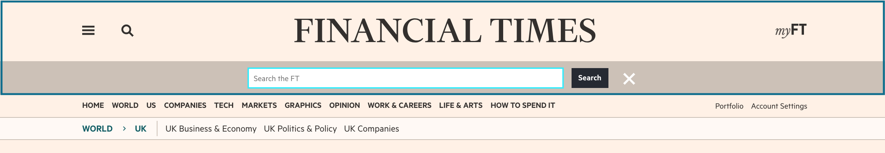
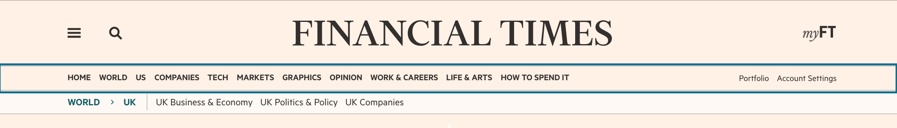

# @financial-times/dotcom-ui-header

This package provides templates which render variants of the FT.com header and navigation.


## Getting started

This package is compatible with Node 8+ and is distributed on npm.

```bash
npm install --save @financial-times/dotcom-ui-header
```

After installing the package you will need to setup your application to fetch data from the [Next Navigation API] required to render these UI components. Anvil provides two packages for this:

1. [`dotcom-middleware-navigation`] (if you are using Express)
2. [`dotcom-server-navigation`] (if you are not using Express)

[Next Navigation API]: http://github.com/Financial-Times/next-navigation-api
[`dotcom-middleware-navigation`]: ../dotcom-middleware-navigation/readme.md
[`dotcom-server-navigation`]: ../dotcom-server-navigation/readme.md

### Server-side

This package provides several UI components to render different parts and styles of the FT.com header:

- `<Header />` the full header with navigation with lots of options. See [header elements](#header-elements) for a breakdown of its parts.
- `<Drawer />` the navigation drawer which should be rendered separately from the header, preferably near the bottom of the document.
- `<LogoOnly>` a simple masthead displaying the logo image which does require any configuration.


```jsx
import { Header, Drawer } from '@financial-times/dotcom-ui-header'

const SiteHeader = (props) => (
  <Header data={props.navigationData} userIsLoggedIn={props.userIsLoggedIn} />
  <Drawer data={props.navigationData} userIsLoggedIn={props.userIsLoggedIn} />
)
```

_Please note_ that the header components are designed to be used on the server-side and should not be rendered on the client-side. Although it is possible to render them on the client-side there is usually no reason to do so and is not supported.

### Client-side

Once you are rendering the header components in your page you will need to initialise the client-side code to add styles and interactive behaviour.

To initialise the client-side JavaScript import the package and call the `.init()` method:

```js
import * as header from '@financial-times/dotcom-ui-header'

header.init()
```

This component includes styles written in Sass which can be imported into your application's main Sass stylesheet.

```scss
@import '@financial-times/dotcom-ui-header/styles';
```

_Please note_ that the exact usage of styles will depend on how you configure your Sass compiler and whether or not you are using Bower to install dependencies.


## Options

All header components with the exception of `<LogoOnly />` require the following options:

| OPTION             | TYPE                               | OPTIONAL | DEFAULT  | DESCRIPTION                                                                    |
|--------------------|------------------------------------|----------|----------|--------------------------------------------------------------------------------|
| variant            | 'simple' \| 'large-logo' \| string | true     | 'simple' | Adds a class name to the header element                                        |
| userIsAnonymous    | boolean                            | true     | true     | Marks a user as anonymous - can be set by middleware included with n-express   |
| userIsLoggedIn     | boolean                            | true     | false    | Marks a user as logged in - can be set by middleware included with n-express   |
| showUserNavigation | boolean                            | true     | true     | Show user navigation options such as `Sign out` or `Subscribe`                 |
| showSubNavigation  | boolean                            | true     | true     | Show the sub-navigation component which may include the crumbtrail             |
| disableSticky      | boolean                            | true     | false    | Prevents the sticky header component from rendering                            |
| data               | object                             | false    |          | Navigation data for rendering the header links fetched from the navigation API |


## Header Elements

### Top

The topmost element - or masthead - contains the logo, toggle buttons for the [drawer](#drawer) and search bar, and the MyFT indicator if logged in.



_Please note_ that the myFT unread articles indicator code lives outside this package in [`n-myft-ui`].

[`n-myft-ui`]: https://github.com/Financial-Times/n-myft-ui/blob/master/components/unread-articles-indicator/index.js#L55

### Navigation

The navigation element contains links for navigating the top-level sections of FT.com. Some of the sections may include subsections which are presented in "mega-nav" dropdown elements.



_Please note_ that the data for this menu is regionally-specific and changes depending on the selected FT edition.

### Sub-navigation

If enabled the sub-navigation element will be rendered if either crumbtrail or subsection navigation data is provided. This is usually page specific and will be automatically set when using the[`dotcom-middleware-navigation`] package.


### Drawer

The drawer menu is a separate component and is not included within the header. It is the primary navigation on small screens and supplementary on large screens. It mostly re-uses the data from the [navigation](#navigation) element but can also have extra groups of links.

To support a non-JS, or core experience, the drawer component should be rendered near the bottom of the document.

### Sticky header

If enabled the sticky header is shown when users scroll down on both small and large screens. It combines similar components to the [top](#top) and [navigation](#navigation) elements.
