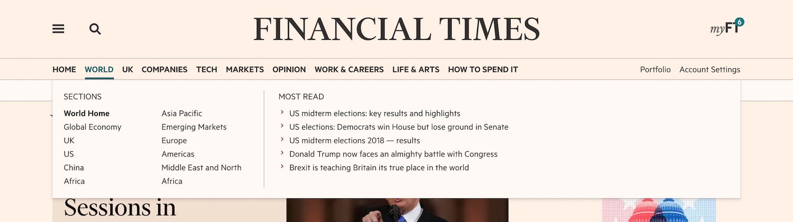

# FT Navigation

The FT Navigation package exposes a NavigationPoller class with some methods for accessing navaigation data for ft.com. This package should be consumed by a Navigation middleware such as [Navigation Middleware] which can handle the responses. // TODO: Fill in a location for our default navigation middleware

Instances of the NavigationPoller will fetch navigation data from the [Origami navigation service](https://registry.origami.ft.com/components/origami-navigation-service@71.0.0) via [ft-poller](https://github.com/Financial-Times/ft-poller). This data is managed by editorial staff and is used to render the navigation components on FT.com including header, drop-down menus, drawer, and footer.


### How it works

Create an instance of the NavigationPoller.

```
const poller = new NavigationPoller
```

The constructor method inside NavigationPoller passes the following config object to ft-poller. Any instances created will begin polling the DATA_URL automatically with a refreshInterval of 15 minutes between polls. The `parseData` option takes the response of each poll and deepFreezes the data to prevent unnecessary calls to the navigation service in between refreshIntervals. `defaultData` is a useful option which ensures that the poller can return data right away before the initial fetch to the navigation service has resolved.
```
{
  url: DATA_URL,
  refreshInterval: 15 * 60 * 1000,
  defaultData: getDefaultData(defaultPollerData),
  autostart: true,
  parseData
}
```

### Available methods

NavigationPoller methods can be utilised by the middleware

`poller.getData()` will return the most recent navigation data from the Origami navigation service. The result is automatically refreshed every 15 minutes to ensure any changes made by Editorial are brought in and stored as a `data` property on the poller instance.

`poller.getCrumbtrail('/world')` will return the crumbtrail data for the passed in location. The crumbtrail is the data which populates the navbar items and the section data visible when the hovering over a nav-item on ft.com.



// TODO: Expand on usage once we have more of the Navigation middleware in in place.
